<div align="center">

<!-- ===================== CINEMATIC HEADER ===================== -->


<br/>

<!-- ===================== ANIMATED TYPING ===================== -->


<br/><br/>

<!-- ===================== STATUS BADGES ===================== -->


<br/><br/>

<!-- ===================== SOCIAL BADGES ===================== -->
<a href="https://linkedin.com/in/tinsae-bahiru-60569a379" target="_blank">
  
</a>
<a href="https://twitter.com/tinsaie_b" target="_blank">
  
</a>
<a href="mailto:tinsaiebbs@gmail.com">
  
</a>
<a href="https://github.com/TinsaeBahiru" target="_blank">
  
</a>

<br/><br/>


</div>

---

<div align="center">

```txt
████████╗██╗███╗   ██╗███████╗ █████╗ ███████╗
╚══██╔══╝██║████╗  ██║██╔════╝██╔══██╗██╔════╝
   ██║   ██║██╔██╗ ██║███████╗███████║█████╗  
   ██║   ██║██║╚██╗██║╚════██║██╔══██║██╔══╝  
   ██║   ██║██║ ╚████║███████║██║  ██║███████╗
   ╚═╝   ╚═╝╚═╝  ╚═══╝╚══════╝╚═╝  ╚═╝╚══════╝
```

### `// MACHINE LEARNING • DATA SCIENCE • ARTIFICIAL INTELLIGENCE`

</div>

---


## 👨‍💻 About Me

I am **Tinsae Bahiru**, an aspiring **Machine Learning Engineer, Data Scientist, and AI Developer** passionate about building intelligent systems that solve real-world problems.

I work with **machine learning, deep learning, computer vision, natural language processing, data science, predictive analytics, generative AI, and MLOps**. My goal is to turn raw data into useful intelligence and deploy models that create real impact.

```yaml
Name: Tinsae Bahiru
Role: Machine Learning Engineer | Data Scientist | AI Developer
Focus: AI, ML, Deep Learning, Computer Vision, NLP, MLOps
Mission: Build intelligent systems for real-world problems
Currently Learning: Transformers, Reinforcement Learning, Generative AI, MLOps
```

<br clear="right"/>

---

<div align="center">

## ⚡ Current Mission

</div>

<table>
<tr>
<td width="50%">

### 🔭 Currently Working On
- End-to-end **AI and ML projects**
- Data science workflows
- Computer vision applications
- NLP and text-based AI systems
- Model training, testing, and deployment

</td>
<td width="50%">

### 🌱 Currently Learning
- Transformer architectures
- Reinforcement learning
- Generative AI
- MLOps pipelines
- Cloud deployment with AWS, GCP, and Docker

</td>
</tr>
<tr>
<td width="50%">

### 🧠 Research Interests
- Deep learning
- Computer vision
- Natural language processing
- Predictive analytics
- AI automation

</td>
<td width="50%">

### 🎯 Long-Term Goal
To become a strong AI/ML engineer who builds reliable, scalable, and impactful AI systems that help people, organizations, and communities.

</td>
</tr>
</table>

---

<div align="center">

```txt
╔══════════════════════════════════════════════════════════════╗
║                    TECHNICAL ARSENAL                       ║
╚══════════════════════════════════════════════════════════════╝
```

</div>

## 🛠️ Skills & Tools

<div align="center">

### 🧠 Machine Learning


<br/><br/>


<br/><br/>

### 🤖 Deep Learning & AI


<br/><br/>


<br/><br/>

### 📊 Data Science & Analytics


<br/><br/>


<br/><br/>

### ☁️ MLOps, Cloud & Deployment


<br/><br/>


</div>

---

<div align="center">

```txt
╔══════════════════════════════════════════════════════════════╗
║                       FOCUS AREAS                           ║
╚══════════════════════════════════════════════════════════════╝
```

</div>

## 🎯 Main Focus Areas

<table>
<tr>
<td align="center" width="33%">


### 🧠 Machine Learning

Building models that learn patterns from data and make accurate predictions.

**Includes:**  
Classification, regression, clustering, feature engineering, and evaluation.

</td>
<td align="center" width="33%">


### 👁️ Computer Vision

Creating AI systems that understand images and visual data.

**Includes:**  
Image classification, object detection, OCR, segmentation, and visual recognition.

</td>
<td align="center" width="33%">


### 🗣️ NLP

Building systems that understand and process human language.

**Includes:**  
Text classification, sentiment analysis, transformers, embeddings, and LLMs.

</td>
</tr>
<tr>
<td align="center" width="33%">


### 📊 Data Science

Turning raw data into useful insights and decisions.

**Includes:**  
Data cleaning, EDA, visualization, statistics, and reporting.

</td>
<td align="center" width="33%">


### ⚙️ MLOps

Taking ML models from experiment to production.

**Includes:**  
Deployment, APIs, Docker, cloud, monitoring, and automation.

</td>
<td align="center" width="33%">


### ✨ Generative AI

Exploring modern AI systems that generate text, images, and intelligent outputs.

**Includes:**  
LLMs, prompt engineering, diffusion models, and AI applications.

</td>
</tr>
</table>

---

<div align="center">

```txt
╔══════════════════════════════════════════════════════════════╗
║                    AI DEVELOPMENT PIPELINE                  ║
╚══════════════════════════════════════════════════════════════╝
```

</div>

## 🔥 My AI Workflow

```mermaid
flowchart LR
    A[Raw Data] --> B[Data Cleaning]
    B --> C[Exploratory Data Analysis]
    C --> D[Feature Engineering]
    D --> E[Model Training]
    E --> F[Model Evaluation]
    F --> G[Model Optimization]
    G --> H[API Deployment]
    H --> I[Cloud / Docker]
    I --> J[Monitoring & Improvement]
```



---

<div align="center">

## 🧩 What I Build

</div>

<table>
<tr>
<td width="50%">

### 🤖 AI Applications
- Intelligent automation systems
- ML-powered apps
- Prediction systems
- Smart dashboards
- AI assistants

</td>
<td width="50%">

### 📈 Data Projects
- Data cleaning pipelines
- Data analysis reports
- Visualization dashboards
- Business insight systems
- Statistical analysis projects

</td>
</tr>
<tr>
<td width="50%">

### 👁️ Vision Systems
- OCR systems
- Image classification
- Object detection
- Image segmentation
- Document AI

</td>
<td width="50%">

### 🧠 NLP Systems
- Text classification
- Sentiment analysis
- Language models
- Chatbot systems
- Document understanding

</td>
</tr>
</table>

---

<div align="center">

```txt
╔══════════════════════════════════════════════════════════════╗
║                       GITHUB METRICS                        ║
╚══════════════════════════════════════════════════════════════╝
```

</div>

## 📊 GitHub Activity

<div align="center">


<br/><br/>


<br/><br/>


</div>

---

<div align="center">

## 🏆 GitHub Trophies


</div>

---

<div align="center">

```txt
╔══════════════════════════════════════════════════════════════╗
║                    CURRENT OPERATIONS                       ║
╚══════════════════════════════════════════════════════════════╝
```

</div>

## 📡 Current Operations

| Icon | Status | Mission |
|---|---|---|
| 🔭 | **Active** | Building end-to-end AI, ML, and Data Science projects |
| 🧠 | **Learning** | Studying Transformers, Reinforcement Learning, and Generative AI |
| ☁️ | **Deploying** | Exploring AWS, GCP, Docker, and MLOps workflows |
| 👁️ | **Experimenting** | Computer Vision, OCR, and image understanding systems |
| 🗣️ | **Researching** | NLP, embeddings, LLMs, and text intelligence |
| 📘 | **Sharing** | Explaining ML and AI concepts in simple ways |
| 🚀 | **Growing** | Improving as an AI/ML engineer every day |

---

<div align="center">

## 💡 AI Quote


</div>

---

<div align="center">

```txt
╔══════════════════════════════════════════════════════════════╗
║                         CONTACT ME                          ║
╚══════════════════════════════════════════════════════════════╝
```

</div>

## 📬 Let's Connect

<div align="center">

<a href="https://linkedin.com/in/tinsae-bahiru-60569a379" target="_blank">
  
</a>

<a href="mailto:tinsaiebbs@gmail.com">
  
</a>

<a href="https://github.com/TinsaeBahiru" target="_blank">
  
</a>

<a href="https://twitter.com/tinsaie_b" target="_blank">
  
</a>

<br/><br/>

> `// Open to collaborations, AI projects, research, learning, and opportunities.`

</div>

---

<div align="center">

## ⚡ Fun Facts

</div>

<table>
<tr>
<td width="50%">

- 🤖 I love building AI-powered applications  
- 📊 I enjoy working with data and discovering hidden patterns  
- 👁️ I am interested in computer vision and OCR systems  
- 🧠 I like learning how intelligent models work  

</td>
<td width="50%">

- 🚀 I enjoy solving real-world problems with technology  
- 📘 I like explaining AI and ML concepts simply  
- ☁️ I am exploring cloud and MLOps deployment  
- 🔥 I am always improving my technical skills  

</td>
</tr>
</table>

---

<div align="center">

## 🌟 Final Message


<br/><br/>


</div>
